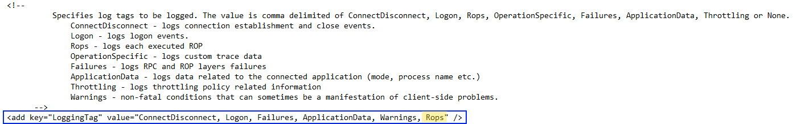

<head>
<link rel="stylesheet" type="text/css" href="style.css">
</head>

# MapiHttp Rop Logging

ROP logging is not enabled by default, mostly because it increases log size significantly and isn't needed to troubleshoot most issues. However, there are times when being able to log individual Rops being sent from the client and those returned from the server is very useful, and even necessary.

## Enable Rop logging for MapiHttp in Exchange 2013/2016:

The process to enable this with MapiHttp is very similar to [enabling ROP logging for RPC Client Access](https://blogs.technet.microsoft.com/mahuynh/2014/09/22/enable-rop-logging-in-exchange-2010-and-2013/). There are enough subtle differences between the two though, so I'll document the steps here to avoid confusion:

To enable ROP logging, you need to edit the web.config file located in the following path: 
*C:\Program Files\Microsoft\Exchange Server\V15\ClientAccess\mapi\emsmdb*

This is a per server setting, meaning you must edit the config file on every server you need to enable ROP logging on.

Open web.config in notepad, then find the **LoggingTag**. Add the 'Rops' tag in the value section, as shown here:

After saving the change, individual Rops will then be included under the 'RopIds' field in MapiHttp mailbox logs, located in the  *"..\V15\Logging\MapiHttp\Mailbox"* directory.

## Making use of the data:

For those that have used Rop logging with RPC Client Access logs before, you'll recall that Rops are logged using the Rop names, making it easy to decipher. With MapiHttp, RopIds are logged rather than the name, so you end up with something that looks like this (highlighting the ROPs in from client, indicated by the '>' character):

2018-11-23T05:00:04.781Z,d9b904f9-5654-4c4c-9a62-43cd99ab6b44,{FA1ACA19-9B3E-458A-B60D-3A18410FEEE2}:153,<null>,Execute,200,0,0,0,6,Unknown,15,1,1531,3,CORP\mbx001,,,,e4f3c049-3f15-4f42-8a85-3eda4155c9b0@corp.supportengineer.pro,4694ca50-35d9-49c8-b0ee-69071d4c9107,mbx001@corp.supportengineer.pro,192.168.10.56,E16MBX1.CORP.SUPPORTENGINEER.PRO,<null>,,MAPIAAAAAODR56rosIGikKCRqYS1hKmbqIi4jLaDtoy5idPwwfDF8sf/xvXN/wwAAAAAAAAA,147-1MB9Qg==,{DC6BADA6-4CDD-4C72-A8E9-26E6B2C01E30}:8,OUTLOOK.EXE,14.0.7187.5000,1,Negotiate,,,,,,,,,Anonymous,>[5]>[18]>[19]>[23]<[5]<[18]<[19]<[23],,cpn=M_ABR/RUM_ABR/RUM_ABRC/M_APAR/M_APRH/M_DTC/M_DTQ/M_DTE/M_RDE/M_RDrE/M_RDrEc/M_RDEc/M_DTEc/M_APoRH/M_AER/;cpv=0/0/0/1/1/1/1/1/1/1/5/5/5/5/5/;Dbl:BudgUse.T[]=8.00380039215088;I32:VCGS.C[E16MBX1]=1;Dbl:VCGS.T[E16MBX1]=0;I32:RPC.C[]=3;Dbl:RPC.T[]=3;I32:ROP.C[]=3053446;I32:MAPI.C[]=9;Dbl:EXR.T[]=1;I32:MB.C[]=3;F:MB.AL[]=1;Dbl:ST.T[]=1;Dbl:MAPI.T[]=3,

